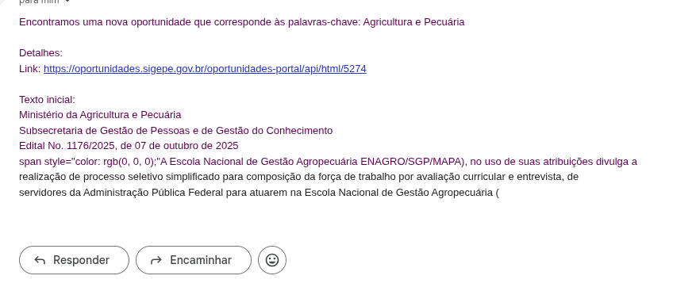

# govOportunidadesScraping

Coletor (Scrapy) para identificar oportunidades governamentais (editais) no portal do SIGEPE, extrair links e texto de PDFs, filtrar por palavras‑chave e notificar por e‑mail. Possui deduplicação entre execuções (SQLite) e agendamento via cron.



## Visão geral
- Spider `edital` acessa a página inicial, segue para páginas de edital e baixa o PDF associado.
- O texto do PDF é extraído (pdfplumber) e então filtrado por palavras definidas em `.env` (KEY_WORDS).
- Itens que casarem são persistidos em SQLite e enviados por e‑mail (MailSender do Scrapy).
- Um controle de “vistos” evita reprocessar PDFs já lidos entre execuções.

## Recursos
- Scrapy + pdfplumber para extrair texto de PDFs.
- Filtro por palavras‑chave configurável via `.env`.
- Deduplicação de notificação (não envia novamente para o mesmo URL).
- Persistência em SQLite:
  - `matching_editais` (itens que casaram com palavras-chave)
- Agendamento via cron (script pronto com lock e logs).

## Estrutura do projeto
```
. 
├─ govoportunidades/
│  ├─ spiders/
│  │  └─ edital.py          # Spider principal
│  ├─ items.py               # Itens: EditalExtractor (url, text)
│  ├─ pipelines.py           # Pipelines: dedupe, SQLite, notificação
│  └─ settings.py            # Settings (dotenv, e-mail, keywords, pipelines)
├─ requirements.txt          # Dependências
├─ dockerfile                # Build e execução do spider no container
├─ scripts/
│  └─ run_crawl.sh           # Script para cron (lock, logs, export)
├─ CRON.md                   # Guia de agendamento no cron
└─ README.md                 # Este arquivo
```

## Requisitos
- Python 3.10+
- Linux/macOS (Windows via WSL/Docker)

## Instalação local (venv)
```fish
# Dentro da pasta do projeto
python3 -m venv mp_env
source mp_env/bin/activate.fish
pip install --upgrade pip
pip install -r requirements.txt
```

## Configuração (.env)
Crie um arquivo `.env` na raiz com, por exemplo:
```ini
# Palavras-chave separadas por vírgula
SCRAPY_KEY_WORDS="engenharia,civil,TI,contrato"

# Notificação por e-mail
SCRAPY_MAIL_TO="destino1@exemplo.com,destino2@exemplo.com"
SCRAPY_MAIL_HOST="smtp.gmail.com"
SCRAPY_MAIL_PORT="587"
SCRAPY_MAIL_USER="seu.email@gmail.com"
SCRAPY_MAIL_PASS="SUA_SENHA_DE_APP"  # veja o tutorial Gmail abaixo
SCRAPY_MAIL_FROM="seu.email@gmail.com"

# Caminho do banco de dados SQLite
EDITAIS_DB_PATH=editais.db
```

## Executando
- Execução simples (exporta JSON para `saida.json`):
```fish
scrapy crawl edital -O saida.json -L INFO
```

Observações importantes:
- Por padrão `ROBOTSTXT_OBEY = True`. Se a origem bloquear o scraping via robots.txt, o spider respeitará.
- O `NotificationDedupPipeline` descarta itens cujo URL já está em `matching_editais` (evita reenvio de e-mail).

## Cron
Há um guia dedicado em `CRON.md` com exemplos. O script `scripts/run_crawl.sh` já implementa:
- Lock (`.crawl.lock`) para evitar concorrência
- Logs em `logs/cron/crawl.log`
- Export para `out/`

Exemplo (a cada 2h):
```cron
0 */2 * * * /bin/bash -lc 'cd /caminho/para/o/projeto && chmod +x scripts/run_crawl.sh && ./scripts/run_crawl.sh'
```

## Banco de dados (SQLite)
- `matching_editais` (no pipeline): armazena URLs/texto/matched_keywords de itens que casaram.
- Caminho configurável por `EDITAIS_DB_PATH` (padrão: `./editais.db`).

## Tutorial: e-mail com Gmail (SMTP)
O Gmail não aceita mais “aplicativos menos seguros”. Para enviar e-mails via SMTP você precisa usar “Senha de app” com 2FA.

Passos:
1) Ative a verificação em duas etapas (2FA) na sua Conta Google:
   - Acesse https://myaccount.google.com/security
   - Em “Como você faz login no Google”, ative “Verificação em duas etapas”.
2) Crie uma Senha de app:
   - Ainda em https://myaccount.google.com/security, em “Como você faz login no Google”, abra “Senhas de app”.
   - Selecione “Aplicativo: Mail” e “Dispositivo: Outro (nomeie, ex.: Scrapy)”.
   - O Google mostrará uma senha de 16 caracteres.
3) Configure o `.env` do projeto:
   - SCRAPY_MAIL_HOST="smtp.gmail.com"
   - SCRAPY_MAIL_PORT="587"
   - SCRAPY_MAIL_USER="seu.email@gmail.com"
   - SCRAPY_MAIL_PASS="SENHA_DE_APP_16_CARACTERES"
   - SCRAPY_MAIL_FROM="seu.email@gmail.com"
   - SCRAPY_MAIL_TO="destino1@exemplo.com,destino2@exemplo.com"
4) TLS/SSL:
   - O projeto usa TLS (porta 587) por padrão nas settings.

Testando envio:
- Rode o spider com `KEY_WORDS` que com certeza casem com seu conteúdo para forçar um e-mail, ou temporariamente ajuste `KEY_WORDS` e/ou um item de teste.
- Verifique `logs/cron/crawl.log` e a caixa de saída do Gmail.

Erros comuns:
- “Username and Password not accepted”: confirme 2FA e Senha de app; não use sua senha normal do Gmail.
- “Connection refused/timeout”: verifique firewall/rede; portas 587 (TLS) liberadas.
- “Daily user sending quota exceeded”: o Gmail impõe limites de envio.

## Dicas e troubleshooting
- pdfplumber não instalado: `pip install pdfplumber` (já consta no requirements.txt).
- Verbosidade de logs: use `-L DEBUG` para maior detalhamento.

## Desenvolvimento
- Formato dos itens (ex.: `EditalExtractor`):
  - `url`: URL da página principal do edital
  - `text`: texto do PDF extraído
- Pipelines e ordem (em `settings.py`):
  - `NotificationDedupPipeline` (150): descarta itens já notificados
  - `SQLitePipeline` (200): persiste matches em `matching_editais`
  - `NotificationPipeline` (300): calcula matches e envia e-mail
